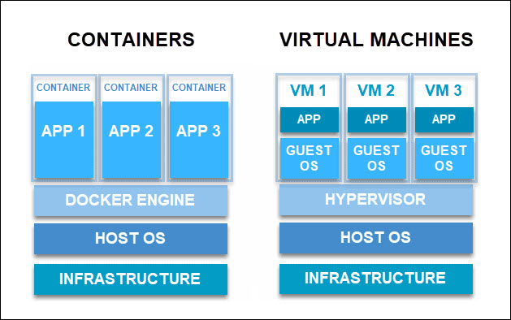

# Módulo 1.1: Fundamentos e Contexto Histórico do Docker

## Objetivo
Compreender profundamente o problema que a tecnologia de containers resolve, a evolução da virtualização que levou ao seu surgimento e as primitivas do kernel Linux que tornam o Docker possível. Este módulo estabelece a base teórica necessária para dominar a arquitetura e operação do Docker.

---

## 1. O Problema da Inconsistência de Ambientes

### O Clássico "Funciona na Minha Máquina"
Uma das frases mais comuns (e frustrantes) no desenvolvimento de software é: *"Mas funciona na minha máquina!"*. Esse dilema ocorre quando um aplicativo se comporta perfeitamente no ambiente de desenvolvimento local de um desenvolvedor, mas falha catastroficamente quando implantado em testes ou produção.

As causas raízes geralmente incluem:
*   **Dependências Diferentes:** Versões conflitantes de bibliotecas, runtimes (como Node.js, Python, Java) ou pacotes do sistema operacional.
*   **Configurações Variáveis:** Diferenças em variáveis de ambiente, configurações de rede ou permissões de arquivos entre os ambientes.
*   **Sistemas Operacionais Distintos:** O desenvolvedor usa macOS ou Windows, enquanto o servidor de produção roda Linux.

### O Abismo entre Desenvolvimento, Teste e Produção
Tradicionalmente, cada fase do ciclo de vida do software (Dev, QA/Staging, Prod) possuía sua própria configuração manual ou scripts de provisionamento propensos a erro ("snowflake servers" [🔗](_snowflake-servers.md)).
*   **Desenvolvimento:** Ambiente flexível, muitas vezes desatualizado ou com ferramentas de debug instaladas.
*   **Teste:** Tentativa de espelhar a produção, mas frequentemente com dados sintéticos e recursos limitados.
*   **Produção:** Ambiente rigoroso, otimizado para performance e segurança, onde mudanças não autorizadas são proibidas.

O Docker resolve isso empacotando a aplicação junto com **todas** as suas dependências em uma unidade padrão (o container), garantindo que o que foi testado seja exatamente o que será executado em produção.

---

## 2. A Evolução da Virtualização

Antes dos containers, a solução predominante para isolamento de ambientes era a Virtualização de Hardware.

### Virtualização Tradicional (Hypervisors)
A virtualização tradicional utiliza um software chamado **Hypervisor** para criar Máquinas Virtuais (VMs). Existem dois tipos principais:
*   **Type 1 (Bare Metal):** O hypervisor roda diretamente sobre o hardware físico (ex: VMware ESXi, Microsoft Hyper-V, KVM). É comum em data centers empresariais.
*   **Type 2 (Hosted):** O hypervisor roda como um aplicativo dentro de um sistema operacional hospedeiro (ex: Oracle VirtualBox, VMware Workstation). Comum em laptops de desenvolvedores.

Em ambos os casos, cada VM executa um **Sistema Operacional Convidado (Guest OS)** completo, incluindo seu próprio kernel, drivers de dispositivo e serviços de sistema.

### Limitações das Máquinas Virtuais
Embora as VMs ofereçam excelente isolamento de segurança, elas apresentam ineficiências significativas para o desenvolvimento ágil e microserviços:
1.  **Overhead de Recursos:** Cada VM consome gigabytes de RAM e CPU apenas para manter o SO convidado rodando, mesmo que a aplicação seja pequena.
2.  **Lentidão no Boot:** Iniciar uma VM envolve carregar um kernel inteiro e inicializar serviços do sistema, o que pode levar minutos. Containers iniciam em milissegundos.
3.  **Consumo de Disco:** Imagens de VMs são pesadas (vários GBs), dificultando o transporte rápido e o versionamento frequente.
4.  **Densidade Baixa:** Devido ao peso, um servidor físico consegue executar muito menos aplicações isoladas via VMs do que via containers.

---

## 3. Tecnologias que Permitiram o Docker (Linux Kernel)

O Docker não criou novas tecnologias de virtualização do zero; ele orquestrou funcionalidades existentes no kernel Linux para criar uma virtualização leve no nível do sistema operacional (OS-level virtualization).

O Docker é escrito na [linguagem de programação Go](https://golang.org/) e aproveita vários recursos do kernel Linux para fornecer sua funcionalidade.

### Namespaces (Isolamento)
Quando você executa um container, o Docker cria um conjunto de namespaces para esse container.

Os **Namespaces** são a característica do kernel que fornece o **isolamento**. Eles fazem com que um processo (e seus filhos) tenha sua própria visão exclusiva de certos aspectos do sistema global. O Docker utiliza vários tipos:

*   **PID Namespace:** Isola a árvore de processos. Dentro do container, o processo principal tem PID 1, sem ver outros processos do host.

*   **NET Namespace:** Isola interfaces de rede, endereços IP, portas e tabelas de roteamento. Cada container tem sua própria pilha de rede.

*   **MNT Namespace:** Isola os pontos de montagem do sistema de arquivos. Permite que o container veja um sistema de arquivos diferente do host.

*   **UTS Namespace:** Isola o hostname e o nome de domínio. O container pode ter seu próprio hostname independente do host.

*   **IPC Namespace:** Isola a comunicação interprocessos (memória compartilhada, filas de mensagens).

*   **USER Namespace:** Mapeia usuários dentro do container para usuários diferentes no host, permitindo que processos rodem como `root` dentro do container, mas como um usuário não privilegiado no host.

### Control Groups (cgroups) (Limitação de Recursos)
Enquanto os namespaces isolam a *visão*, os **Control Groups (cgroups)** gerenciam e limitam o **uso de recursos**. Eles permitem que o Docker imponha limites rigorosos para evitar que um container consuma todos os recursos da máquina:
*   **CPU:** Limita a porcentagem de tempo de processador que um container pode usar.
*   **Memória:** Define limites máximos de RAM e comportamento em caso de estouro (OOM - Out of Memory).
*   **I/O de Disco:** Controla a taxa de leitura/escrita no disco.
*   **Dispositivos:** Restringe o acesso a dispositivos específicos.

### Union File Systems (OverlayFS) (Eficiência de Armazenamento)
O Docker utiliza sistemas de arquivos em camadas (Union File Systems), sendo o **OverlayFS** o driver padrão.

*   **Camadas Imutáveis:** Uma imagem Docker é composta por várias camadas de leitura apenas (read-only). Cada instrução no `Dockerfile` cria uma nova camada.

*   **Copy-on-Write (CoW):** Quando um container é iniciado, uma fina camada gravável (read-write) é adicionada no topo. Se o container precisa modificar um arquivo existente nas camadas inferiores, o sistema copia esse arquivo para a camada superior antes de modificá-lo.

*   **Benefício:** Isso permite compartilhar camadas base entre múltiplas imagens e containers, economizando drasticamente espaço em disco e acelerando downloads (apenas as camadas faltantes são baixadas).

### Chroot (Mudança de Raiz)
A chamada de sistema `chroot` muda o diretório raiz aparente (`/`) para um processo e seus filhos. Embora usado historicamente, hoje é parte integrante da criação do ambiente de arquivo isolado pelo namespace de montagem, garantindo que o processo não possa acessar arquivos fora da estrutura de diretórios designada para o container.

---

### Conclusão do Módulo
O Docker transformou o desenvolvimento de software ao substituir a virtualização pesada de hardware pela virtualização leve de sistema operacional, aproveitando namespaces e cgroups do Linux. Ao padronizar a entrega de software em unidades portáteis (containers) derivadas de imagens imutáveis, ele eliminou a inconsistência de ambientes, permitindo fluxos de trabalho de CI/CD robustos e arquiteturas de microserviços escaláveis.

### Próximos Passos

- [O que é o Docker](1-2_o-que-e-o-docker.md)