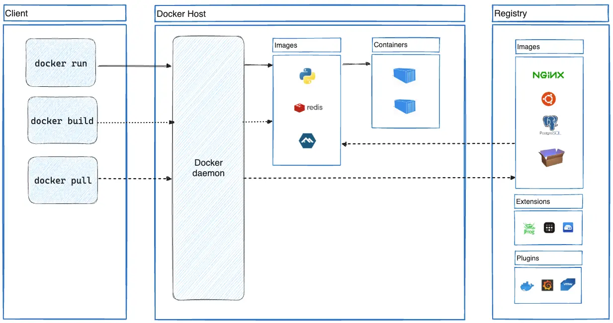

# Módulo 1.1 O que é Docker?

O Docker usa uma arquitetura cliente-servidor. O cliente Docker comunica-se com o daemon Docker, que faz o trabalho pesado de construir, executar e distribuir seus containers Docker. O cliente Docker e o daemon podem ser executados no mesmo sistema, ou você pode conectar um cliente Docker a um daemon Docker remoto. O cliente Docker e o daemon se comunicam usando uma API REST, através de sockets UNIX ou uma interface de rede. Outro cliente Docker é o [Docker Compose](https://docs.docker.com/compose/intro/compose-application-model/), que permite trabalhar com aplicações compostas por um conjunto de containers.

## A plataforma Docker

O Docker fornece a capacidade de empacotar e executar uma aplicação em um ambiente levemente isolado chamado container. O isolamento e a segurança permitem que você execute muitos containers simultaneamente em um determinado host. Os containers são leves e contêm tudo o que é necessário para executar a aplicação, então você não precisa depender do que está instalado no host. Você pode compartilhar containers enquanto trabalha e ter certeza de que todos com quem compartilha recebem o mesmo container que funciona da mesma maneira.

O Docker fornece ferramentas e uma plataforma para gerenciar o ciclo de vida dos seus containers:

*   Desenvolva sua aplicação e seus componentes de suporte usando containers.
*   O container torna-se a unidade para distribuir e testar sua aplicação.
*   Quando estiver pronto, implante sua aplicação em seu ambiente de produção, como um container ou um serviço orquestrado. Isso funciona da mesma forma, seja seu ambiente de produção um data center local, um provedor de nuvem ou um híbrido dos dois.

## Para que posso usar o Docker?

### Entrega rápida e consistente de suas aplicações

O Docker simplifica o ciclo de vida do desenvolvimento, permitindo que os desenvolvedores trabalhem em ambientes padronizados usando containers locais que fornecem suas aplicações e serviços. Containers são excelentes para fluxos de trabalho de integração contínua e entrega contínua (CI/CD).

Considere o seguinte cenário de exemplo:

- Seus desenvolvedores escrevem código localmente e compartilham seu trabalho com seus colegas usando containers Docker.
- Eles usam o Docker para enviar suas aplicações para um ambiente de teste e executar testes automatizados e manuais.
- Quando os desenvolvedores encontram bugs, eles podem corrigi-los no ambiente de desenvolvimento e reimplantá-los no ambiente de teste para testes e validação.
- Quando o teste é concluído, levar a correção ao cliente é tão simples quanto enviar a imagem atualizada para o ambiente de produção.

### Implantação responsiva e escalabilidade

A plataforma baseada em containers do Docker permite cargas de trabalho altamente portáteis. Os containers Docker podem ser executados no laptop local de um desenvolvedor, em máquinas físicas ou virtuais em um data center, em provedores de nuvem ou em uma mistura de ambientes.

A portabilidade e a natureza leve do Docker também tornam fácil gerenciar dinamicamente as cargas de trabalho, escalando ou desmontando aplicações e serviços conforme as necessidades de negócios ditam, quase em tempo real.

### Executando mais cargas de trabalho no mesmo hardware

O Docker é leve e rápido. Ele fornece uma alternativa viável e econômica às máquinas virtuais baseadas em hypervisor, para que você possa usar mais da capacidade do seu servidor para atingir seus objetivos de negócios. O Docker é perfeito para ambientes de alta densidade e para implantações pequenas e médias onde você precisa fazer mais com menos recursos.

## Arquitetura do Docker

### Cliente Docker vs. Daemon (`dockerd`)
O Docker segue uma arquitetura **Cliente-Servidor**:
*   **Docker Client (CLI):** O cliente Docker (`docker`) é a principal maneira pela qual muitos usuários do Docker interagem com o Docker. Quando você usa comandos como `docker run`, o cliente envia esses comandos (via API REST) para o `dockerd`, que os executa. O comando `docker` usa a API Docker. O cliente Docker pode se comunicar com mais de um daemon.

*   **Docker Daemon (`dockerd`):** É o serviço de longa execução (background) que gerencia objetos Docker (imagens, containers, redes, volumes). Ele escuta solicitações da API e executa as operações reais no kernel (criando namespaces, cgroups, etc.). Um daemon também pode se comunicar com outros daemons para gerenciar serviços Docker.

> **Fluxo:** Você digita `docker run` -> O CLI envia a requisição para o Daemon -> O Daemon baixa a imagem (se necessário), cria o container usando primitives do kernel e inicia o processo.

### Registry (Registro de Imagens)
Um registro Docker armazena imagens Docker. O Docker Hub é um registro público que qualquer pessoa pode usar, e o Docker procura imagens no Docker Hub por padrão. Você pode até executar seu próprio registro privado.

Quando você usa os comandos `docker pull` ou `docker run`, o Docker puxa as imagens necessárias do seu registro configurado. Quando você usa o comando `docker push`, o Docker envia sua imagem para o seu registro configurado.

### Imagens vs. Containers
É fundamental distinguir estes dois conceitos:
*   **Imagem (Image):** Uma imagem é um modelo somente leitura com instruções para criar um container Docker. Frequentemente, uma imagem é baseada em outra imagem, com alguma personalização adicional. Por exemplo, você pode construir uma imagem baseada na imagem Ubuntu, mas que inclua o servidor web Apache e sua aplicação, bem como os detalhes de configuração necessários para fazer sua aplicação funcionar.

*   **Container:** Um container é uma instância executável de uma imagem. Você pode criar, iniciar, parar, mover ou excluir um container usando a API Docker ou a CLI. Você pode conectar um container a uma ou mais redes, anexar armazenamento a ele ou até mesmo criar uma nova imagem com base em seu estado atual.

## Próximos passos

- [Instalar Docker](_install-docker.md)
- [O que é um Container](2-1_o-que-e-um-container.md)